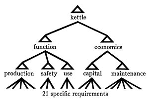
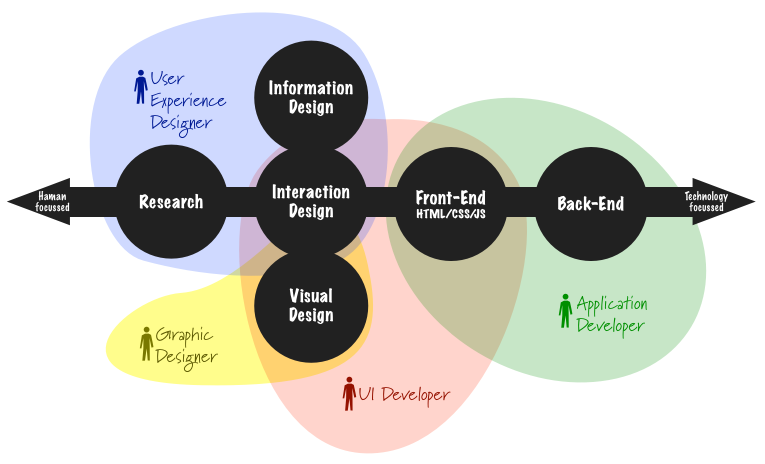
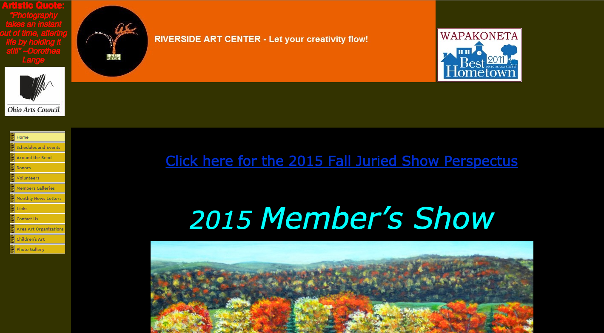

# Crash Course on UX and Web Application Prototyping

---

# What is Design?

^ Design is how it works. It requires deep thought.

---

# What is User Experience (UX) Design?

^ **Visual Design:** graphic treatment of interface elements (the “look” in “look-and-feel”)

^ **Interface Design:** as in traditional HCI: design of interface elements to facilitate user interaction with functionality

^ **Interaction Design:** development of application flows to facilitate user tasks, defining how the user interacts with site functionality

^ **User Experience Design:** I believe there's no such thing. You can't design another person's experience, only the interface they see and interact with.

---

# What is Interaction Design?

> Interaction Design is using hierarchy and contrast to make an application and its interactions obvious and self-explanatory.

-- Me

> "Don't make me think!"

-- Steve Krug

---

# (Some) Principles of Interaction Design
1. Navigation should be obvious
2. Interaction should be direct
3. Information should be arranged hierarchically.

^ Similarity Enclosure Continuation Closure

---

# Bad
## [http://www.riversideartcenter.org](http://www.riversideartcenter.org)

---

# Bad
## [http://www.msy.com.au/home.php](http://www.msy.com.au/home.php)

---

# Good
## [https://www.southcarolinablues.com/web/public/sc/](https://www.southcarolinablues.com/web/public/sc/)

---

# The Process
1. Start with nouns
2. Make a site map using verbs 
3. Sketch on paper.
4. Create a wireframe.
5. Create a prototype.

---

# Start with Nouns
## The Domain Model

^ Create a ubiquitous language. What kind of information is stored in the app? Are the different kinds of information related to each other? How? Can you interact the information? In what way?

---

# Make a site map
## Use nouns + verbs for a starting point

^ The common web application verbs are index (list), show, create, edit, and delete
^ Trello is a good example of an application that uses this, but diverges from it.

---

# Sketch on paper
## Give your mind a framework to hang details on

---

# Create a wireframe
## Get feedback on information hierarchy

---

# Create a prototype
## Get feedback on interaction design

^ Interaction design is more important than visual design.

---

# Develop It
## Or hire someone to develop it
### Or come learn how to develop it :)

